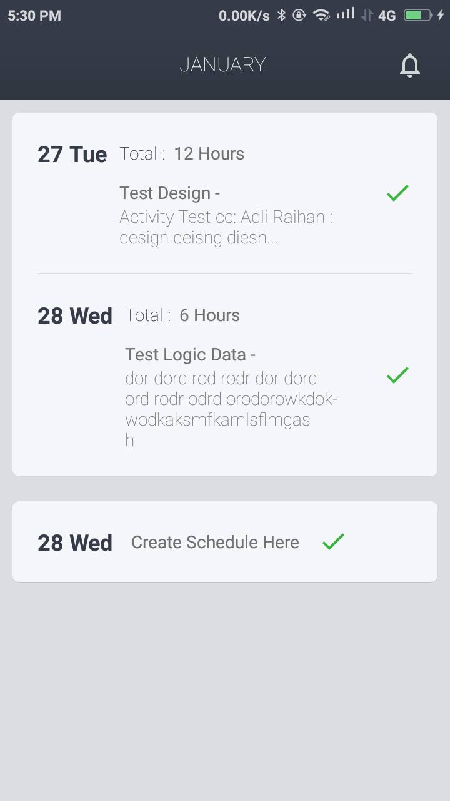
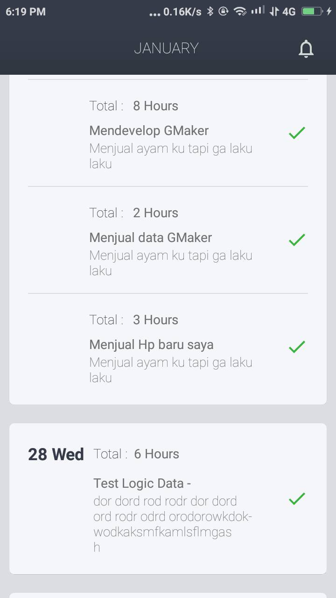
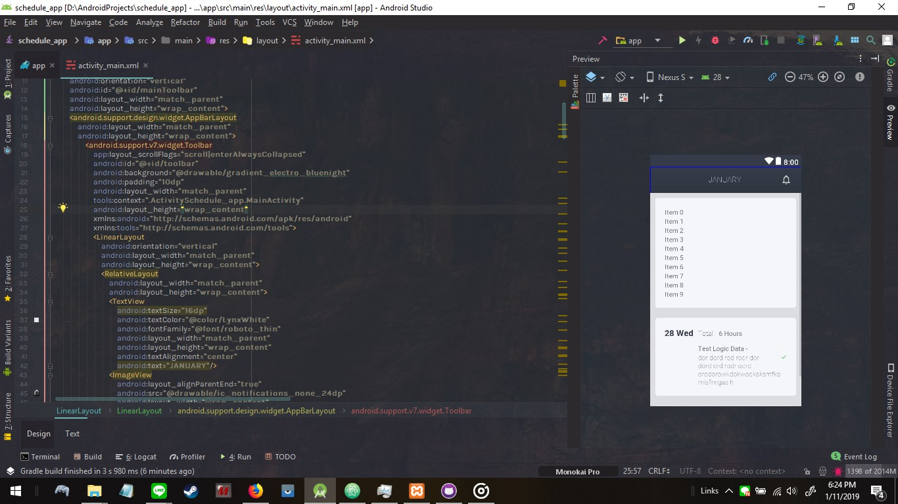

# ScheduleApp
Season lanjutan dari GMAKER & Pengambilan data melalui JSON

Kotributor : 
<b>Adli Raihan</b> 
 
Bahasa Program di projek ini : 
1 Kotlin <i>sudah upload</i> 
2 <B>PHP</B> <i>belum upload</i>  
3 HTML & CSS & JS <i>belum upload</i> 
 
Framework : 
1 Bootstrap <i>CSS</i>  
2 Flutter.io <i>Android <b>lagi belajar</b></i> 
3 jQuery <i>JS</i>  
 
Database : 
1 MYSQL! 
 

Target Applikasi Bulan ini <i>Implementasi layout ini dengan hard coding</i>  

<h5>Source Code Img</h5>
 

<i>Applikasi</i> 

 Implementasi Code baru secara manual yaitu melalui code <b>array</b> dan belum secara database 
+ jangan hiraukan data dalaman diatas karena random banget saya itu ngisinya hehe

 
<h3>Inspirasi Design</h3>

<a href="https://www.pinterest.com/pin/834221530946459856/visual-search/?x=16&y=12&w=530&h=397"> Link Pinterest Author Mockup</a>
 
<i>Note:</i> saya tidak berniat untuk melakukan plagiarism karena pada intinya design yang ada di aplikasi ini ditulis codenya oleh
saya sendiri dengan tanpa menirukan mockup secara 100% dan/atau aplikasi sama sekali tidak di perjual belikan .

<i> any question ? </i> 
Contact : adliraihan002@gmail.com 
ID Line : adliraihan 
Instagram : adli.raihan 
Twitter : adli_raihan  
<i>Segala pertanyaan akan saya jawab , kecuali pertanyaan yang tidak ada hubungannya dengan jobdesk saya sebagai backend android / frontend android / <b>newbie</b> backend web</i>
